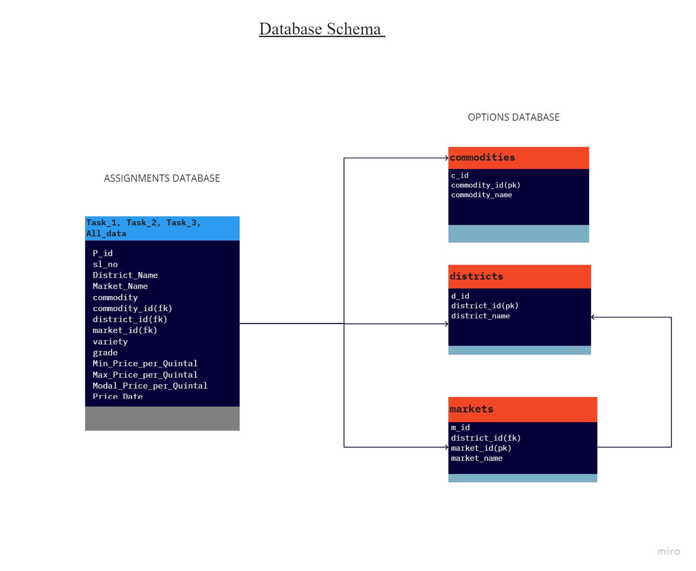

# Agmarknet WebScraper

A project to scrape the data from a govt website for price of various Commodities sold in the Indian state of  Maharastra's various Districts and their corresponding Markets between 01-Jan-2021 and 10-Aug-2021

## Installation

### Creating a virtual environment to keep dependencies isolated.

Commands needed for activate/deactivate virtual environment using [pip](https://pip.pypa.io/en/stable/):
```bash
pip -h
pip install virtualenv
virtualenv venv
venv\Scripts\activate
deactivate
```
Commands needed for activate/deactivate virtual environment using
[conda](https://www.anaconda.com/products/individual):
```bash
conda -V
conda update conda
conda create -n venv python= x.x[python version] anaconda
activate venv
conda deactivate
```

Use the package manager [pip](https://pip.pypa.io/en/stable/) or [conda](https://www.anaconda.com/products/individual) to install all the required packages.

```bash
pip install -r requirements.txt

or

conda install --file requirements.txt
```

## Usage

User input options : 1 / 2 / 3

Task 1 : Fetch prices data for the commodity Tomato sold in all markets of the Pune district, Maharashtra.

Task 2 : Fetch prices data for the commodity Tomato sold in all markets of all districts of Maharashtra.

Task 3 : Fetch prices data for all commodities sold in all markets of all districts of Maharashtra.

```bash

python tasks.py
 
```
## A Short Note:

The WebScraper script fetches the URL and parses through the HTML source file which is parsed using a html parser.
As the parser locates the table , it is fed into a Pandas DataFrame subsequently, the cursor now searches for the 'next button' to get to the next page, to fetch the remaining part of the resultant table, until it reaches the end of the result. All the fetched data will be appended to a master DataFrame during the looping.
SQLAlchemy, an object Relational Mapper is used to map all the data in the DataFrame to a Database table in the MySQL server.  


## File Structure
```
Agmarknet-Webscraper
├── webscraping_scripts
│   ├── tasks.py
│   ├── Commodities.py
│   ├── Districts.py
│   ├── Markets.py
│   └── Alternate_Scraper.py
├── databases
│   ├── assignment1.sql
│   ├── task1.sql
│   ├── task2.sql
│   ├── task3.sql
│   ├── options.sql
│   ├── commodities.sql
│   ├── districts.sql
│   └── markets.sql
├── tests
│   └── test.py
├── Images
│   └── db_schema.jpg
├── README.md
├── requirements.txt
├── LICENSE
└── .gitignore
```

## Database Storage
Pandas DataFrame is utilized to store the data collected initially by appending to the master DataFrame, it acts as a mediator between Python and SQLAlchemy and bridges the gap and versatile functions of Pandas facilitates the transfer of data.

MySQL was used to store the fetched data.

SQLAlchemy was utilized to map the data in the form of DataFrames to the MySQL database tables.

## Database Schema:



## License
[MIT](https://choosealicense.com/licenses/mit/)
